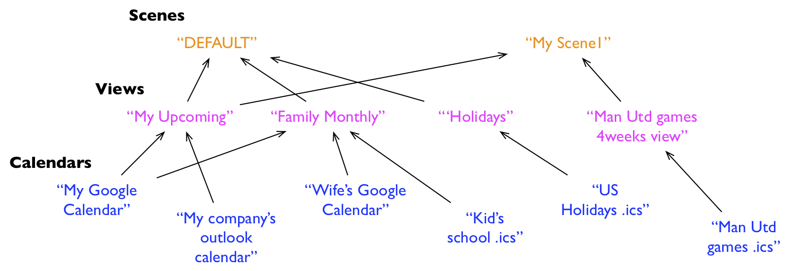
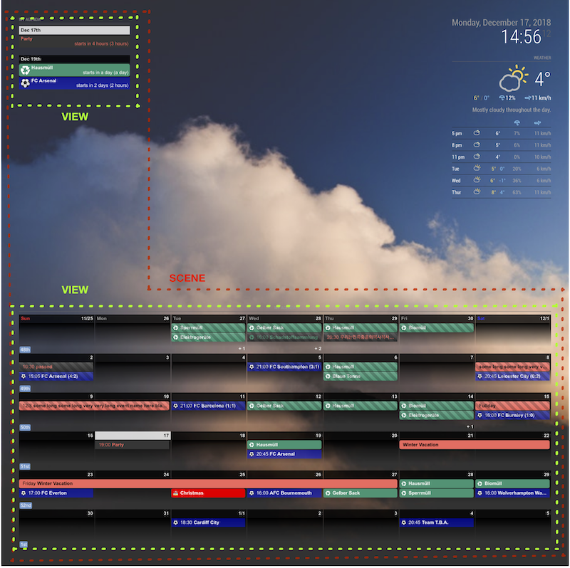

# Simple Example & Basic Concept
```javascript
{
  module: 'MMM-CalendarExt2',
  config: {
    calendars : [
      {
        url: "https://www.google.com/calendar/ical/ovb564thnod82u5c4njut98728%40group.calendar.google.com/public/basic.ics",
      },
    ],
    views: [
      {
        mode: "daily",
      },
    ],
    scenes: [
      {
        name: "DEFAULT",
      },
    ],
  },
},
```
This is the simplest configuration. I'll explain step by step.

There should be AT LEAST one **scene**, one **view** and one **calendar**.

**Concept**


- You should have at least ONE Scene for display your events.
- Each Scene could have at least ONE View. You can assume each scene as a profile or page.
- Each View decide how to show events. It can could have at least ONE calendar or more. You can choose to show which calendar events and how to be displayed and more by configuration.
- A Calendar is your .ics file or URL. You can manipulate events by configuration.
- To point specific Scene/View/Calendar, It could have `name`. and almost everything will be configurable.

> In below guides, all fields except **REQUIRED** could be omitted. When omitted, `default value` will be used.

- [Scene Configuration](Configuration/Scene.md)
- [Calendar Configuration](Configuration/Calendar.md)
- [View Options](Configuration/View.md) : Read subsection of this also. Very important.
- [defaultSet Options](Configuration/defaultSet.md)
- [Other Config Options](Configuration/Others.md)


